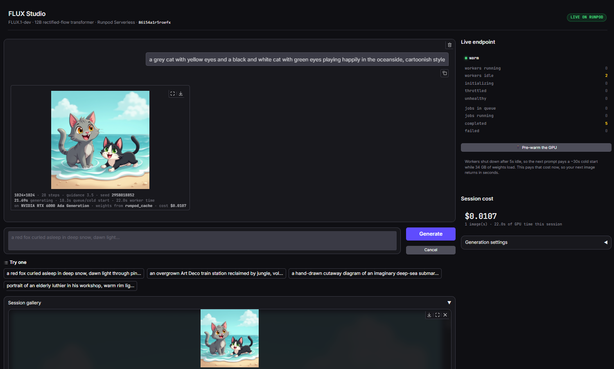

# Image generator using FLUX.1-dev on RunPod

Type a sentence, get a picture. The picture is made by an AI model running on a
rented graphics card that switches on when you ask for something and switches
off five seconds after it finishes. When nobody is using it, it costs nothing.

**Live demo:** https://flux-serverless-demo.onrender.com
**Login:** `reviewer`, password sent with the submission

The page is on a free host that sleeps when nobody visits, so the first load
takes about 50 seconds. The first picture takes another 30 seconds or so while a
graphics card wakes up and loads the model. After that, pictures come back in
seconds. There is a button called **Pre-warm the GPU** that gets the card ready
before you type, if you would rather not wait.



The prompt is at the top, the picture the model made is underneath, and below
that are the details of how it was made: the seed, how long it took, which
graphics card ran it, that the model came from RunPod's cache, and that it cost
just over one cent. The panel on the right is the live state of the endpoint.

## What this is

The model is **FLUX.1-dev** by Black Forest Labs. It turns sentences into
pictures. It is about 34 gigabytes, far too big for a normal laptop, so it runs
on a graphics card in a data centre.

The graphics card is rented from **RunPod** one second at a time. This is called
serverless. Rather than renting a machine that runs all day, the machine only
exists while it is doing your job.

The chat page is a small Python program hosted for free on **Render**. It does no
AI work at all. It passes your words to RunPod and shows you what comes back.

| | |
|---|---|
| Time to make one picture | about 16 seconds |
| Cost of one picture | about one cent |
| Cost when nobody is using it | nothing |
| Requests sent while building this | 23, none failed |
| Total spent building and testing | under 1 dollar |

## How a request travels

1. You type a sentence on the web page.
2. The page sends it to my Python program on Render. **The browser never talks
   to RunPod directly.**
3. My program adds my RunPod password and sends the job.
4. RunPod wakes a graphics card if none is running, and loads the model into it.
5. The card does 28 rounds of work, turning random noise into your picture. After
   every round it sends back a progress update.
6. My program asks RunPod for an update about once a second and refreshes the
   page, so you watch it count from 1 of 28 up to 28 of 28.
7. The finished picture comes back and appears in the chat with its details.
8. Five seconds later the graphics card switches off and the cost returns to
   zero.

## Why the page shows progress

Making a picture takes about 16 seconds and most apps hide that behind a
spinning circle. This one does not. The code on the graphics card reports after
every round of work, so you can see it happening:

```
Queued, asking RunPod for a graphics card
Cold start, a card is switching on and loading the model
Encoding your prompt
Denoising  ############----------  14 of 28
Decoding the result into an image
Done. 28 steps, seed 2958018852, 21.7 seconds, cost 1 cent
```

The page also shows how many graphics cards are running right now, so you can
watch one switch on and then switch off again, and it keeps a running total of
what you have spent.

## The decisions I made

**The model is not inside the container.** The instructions suggested putting it
there. I did not, for two reasons. RunPod builds containers with a hard 30 minute
limit, and downloading 34 gigabytes will not finish in that time. Also this model
needs a password to download, and RunPod's build system has no safe way to give
it one, so the only option would be writing my password into a public file.

RunPod's own documentation recommends their cached model feature for this exact
situation, so I used it. They copy the model onto the machine ahead of time. That
copy took 28 minutes, happened once, and was not charged. My container ended up
12 gigabytes instead of 46, and the model now loads in 7 seconds. I also wrote a
backup that downloads the model itself if the cache is ever missing.

**The password never reaches the browser.** If the web page talked to RunPod
directly, my RunPod password would sit in the page for anyone to copy and spend
my money. RunPod has no safe to publish password and no way to lock one to a
single website, so I put a small Python program in between. Only that program
knows the password.

**I ask for updates rather than waiting.** RunPod offers two ways to request a
picture. One waits for the answer but gives up after 90 seconds, which a slow
first request can exceed. The other gives you a job number straight away and lets
you ask for updates. I use the second, because it never times out and it is the
only way to get the progress information.

**A 48 gigabyte graphics card.** The model needs about 34 gigabytes just to sit
on the card. A smaller card would work but would keep swapping data in and out
and be several times slower. I listed three card sizes in order of preference so
a busy data centre does not leave me waiting.

**Zero always on workers.** This is the setting that protects the budget. Left at
one, a graphics card would run all day whether used or not, about 42 dollars a
day. At zero, the card only exists while it is making a picture.

## Sending a request without the web page

```bash
curl -X POST https://api.runpod.ai/v2/YOUR_ENDPOINT_ID/run \
  -H "Authorization: Bearer YOUR_API_KEY" \
  -H "Content-Type: application/json" \
  -d '{"input": {"prompt": "a red fox in deep snow", "num_inference_steps": 28}}'
```

| Setting | Default | What it does |
|---|---|---|
| `prompt` | required | What you want to see |
| `negative_prompt` | empty | What you do not want. Roughly doubles the time |
| `width`, `height` | 1024 | Picture size, from 256 to 1536 |
| `num_inference_steps` | 28 | Rounds of work. More is better and slower |
| `guidance` | 3.5 | How strictly it follows your words |
| `seed` | random | Same seed and same words gives the same picture |
| `image_format` | png | `png` or `jpeg` |
| `num_images` | 1 | Maximum 2, because of a reply size limit |
| `warmup` | false | Gets the card ready without making a picture |

## What is in each folder

| Folder | What is in it |
|---|---|
| `worker` | The code that runs on the graphics card |
| `app` | The chat page |
| `scripts` | A script for sending a test request to the endpoint |
| `docs` | The screenshot |

## Running it yourself

The page has a practice mode that fakes everything, so you can look around
without any passwords and without spending anything:

```bash
python -m venv .venv
.venv/Scripts/pip install -r app/requirements.txt
RUNPOD_MOCK=1 python app/app.py
```

For real pictures you need a RunPod account with an endpoint running this
worker, then set three things before starting the page:

```
RUNPOD_API_KEY       your RunPod key
RUNPOD_ENDPOINT_ID   the endpoint it should talk to
APP_PASSWORD         a password for the page
```

## Known limits

- The free web host sleeps after 15 minutes, so the first visit takes about a
  minute.
- RunPod winds down endpoints nobody uses. After three days it reduces them and
  after seven days it switches them off, so a demo left alone for a couple of
  weeks will look dead until that setting is raised again.
- Maximum two pictures per request, because of a limit on how much data RunPod
  will send back in one reply.
- Negative prompts roughly double the time, because of the way this model works.

## Licence

The code here is MIT licensed, so anyone may use it. The FLUX.1-dev model itself
belongs to Black Forest Labs under a non commercial licence and is not included
here. It is downloaded when the endpoint is set up.
