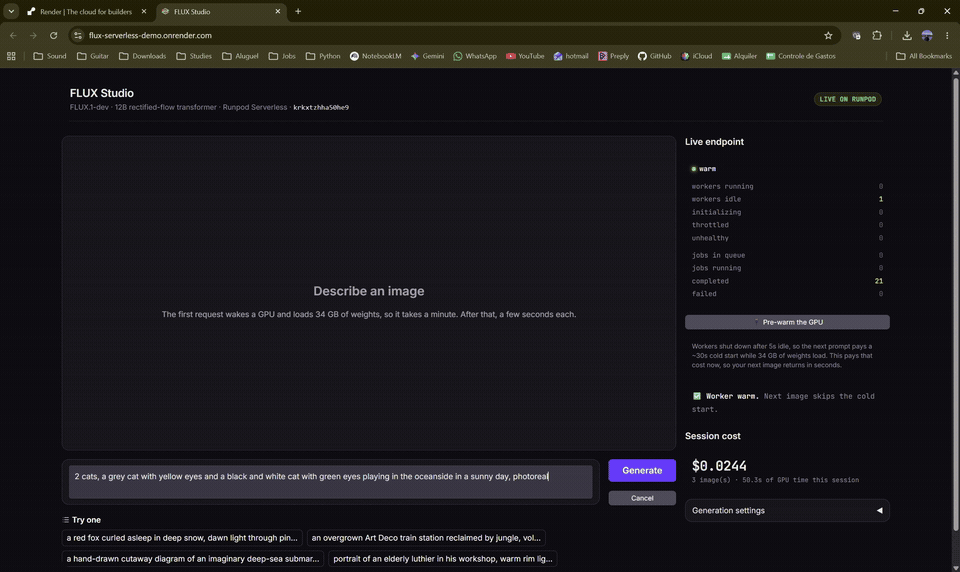
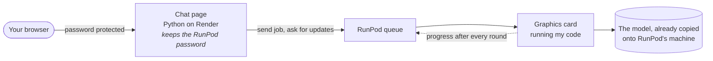
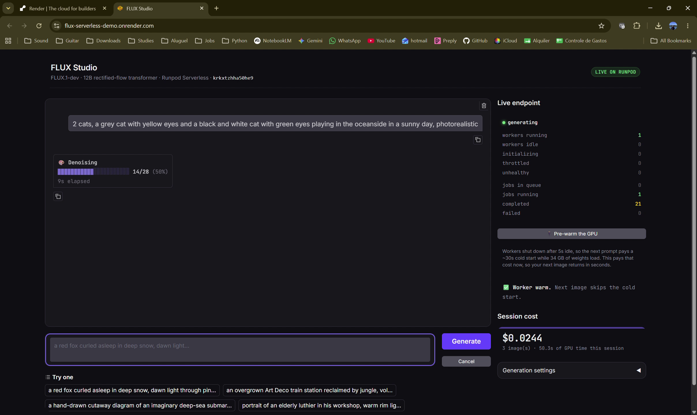
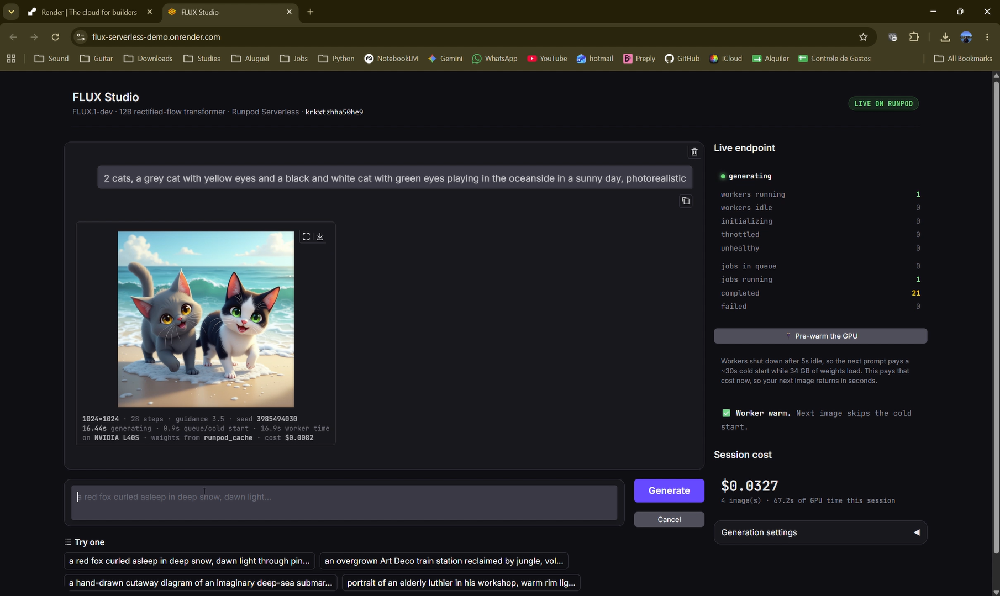
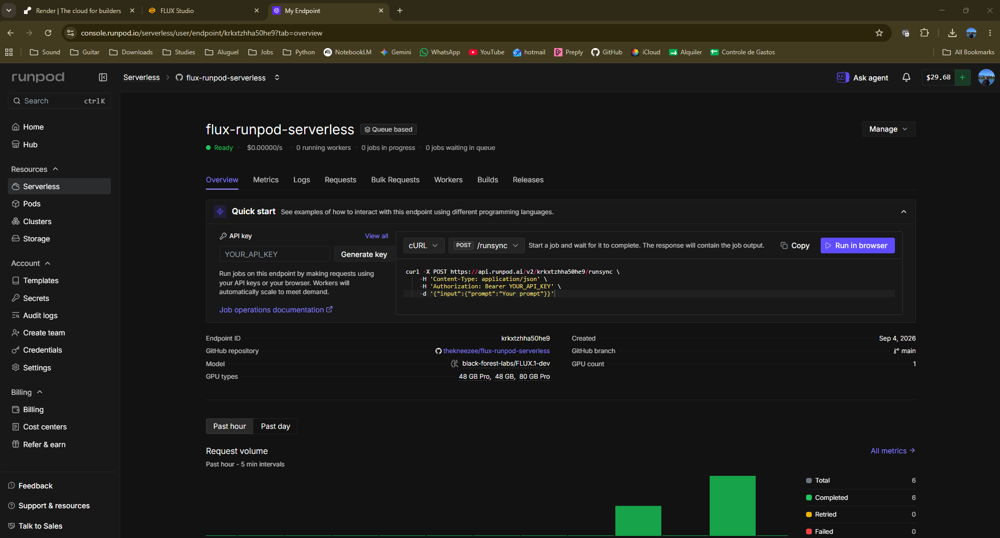
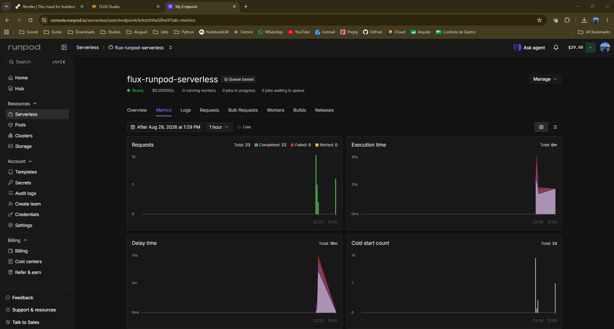
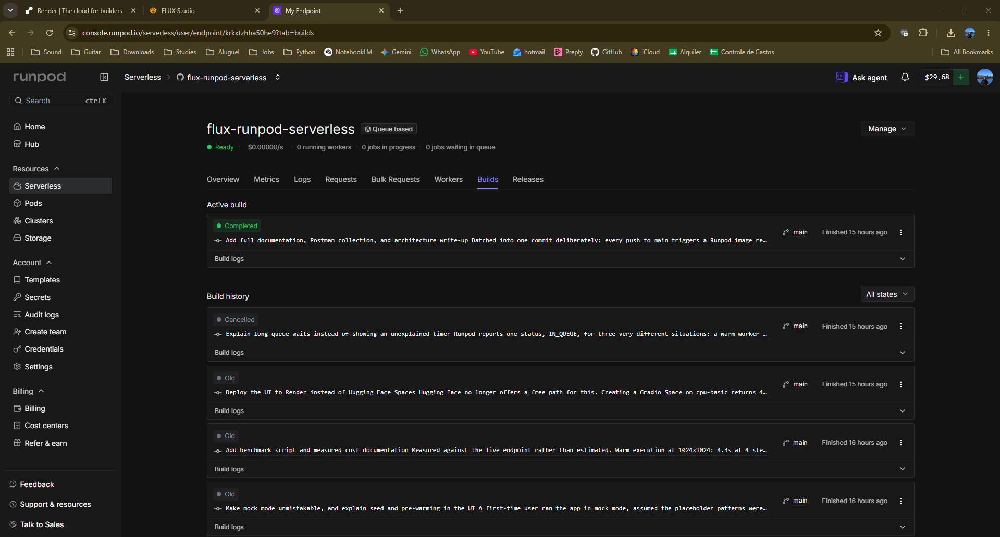

# FLUX Studio

Type a sentence, get a picture. The picture is made by an AI model running on a
rented graphics card that switches itself on when you ask for something and
switches off five seconds after it finishes. When nobody is using it, it costs
nothing.

**Live demo:** https://flux-serverless-demo.onrender.com
**Login:** `reviewer` and the password sent with the submission

> The web page is on a free host that goes to sleep when nobody visits, so the
> first time you open it you will wait about 50 seconds. Then the first picture
> takes another 30 seconds or so while a graphics card wakes up and loads the
> model. After that, pictures come back in seconds. There is a button called
> **Pre-warm the GPU** that gets the card ready before you type, if you want to
> skip that wait.



*A real request going from queued, through 28 rounds of work on a live graphics
card, to a finished picture.*

---

## What this actually is

The model is **FLUX.1-dev**, made by Black Forest Labs. It turns sentences into
pictures. It is about 34 gigabytes, which is far too big to run on a normal
laptop, so it runs on a graphics card in a data centre.

The graphics card is rented from **RunPod**, one second at a time. This is
called serverless. Instead of renting a machine that runs all day, the machine
only exists while it is doing your job.

The chat page you type into is a small Python program hosted for free on
**Render**. It does no AI work at all. It just passes your words to RunPod and
shows you what comes back.

| | |
|---|---|
| Time to make one picture | about 16 seconds |
| Cost of one picture | about 0.8 of a cent |
| Cost when nobody is using it | nothing |
| Requests sent while building this | 23 |
| Requests that failed | 0 |
| Total spent building and testing it | under 1 dollar |

**New to any of this?** Read [EXPLAINED.md](EXPLAINED.md). It explains every
part of this project in plain language, including what all the words mean.

---

## Why the interface matters

Making a picture takes about 16 seconds, and behind those 16 seconds a lot is
happening. Your request waits in a queue. A graphics card switches on. A 34
gigabyte file loads into it. Then the model does 28 rounds of work, slowly
turning random noise into your picture.

Most apps hide all of that behind a spinning circle.

This one does not. The code on the graphics card sends a small update after
every single round, and the web page updates as they arrive. So you see this:

```
Queued, asking RunPod for a graphics card
Cold start, a card is switching on and loading the model
Encoding your prompt
Denoising  ████████████░░░░░░░░░░  14 of 28  (50%)
Decoding the result into an image
Done. 1024x1024, 28 steps, seed 481923
16.4 seconds, on an NVIDIA L40S, cost 0.8 cents
```

Alongside that, the page shows:

- **What the endpoint is doing right now.** It checks RunPod every three seconds
  and shows how many graphics cards are running. You can watch one switch on and
  then switch off again.
- **What you have spent** this session, worked out from the real time used and
  RunPod's real prices.
- **A pre-warm button** that gets a card ready before you type.
- **The seed of every picture**, so you can make the exact same picture again.
- **A cancel button** that actually stops the job on RunPod.
- **A free practice mode** that fakes everything, so anyone can try the interface
  without a password or any cost.

---

## How it fits together



Three layers, and every one of them costs nothing when idle. Someone trying the
demo costs a few cents. Leaving it alone costs zero.

---

## The main decisions

### The model is not inside the container

The instructions suggested putting the model inside the Docker container. I did
not do that, for two solid reasons.

RunPod builds containers with a hard 30 minute limit, and downloading 34
gigabytes will not finish in that time. Also, FLUX.1-dev is a protected model
that needs a password to download, and RunPod's build system has no safe way to
supply one. The only way would be writing my password into a public file.

RunPod's own documentation says that for models like this, the right approach is
their cached model feature: you tell RunPod the model name and they copy it onto
the machine in advance. So I used that. The copy took 28 minutes, happened once,
and **was not charged**. My container is 12 gigabytes instead of 46, and the
model loads in 7 seconds.

I still wrote a backup that downloads the model itself if the cache is ever
missing, and every response says which route it used so I can check.

### The password never reaches your browser

If the web page talked to RunPod directly, my RunPod password would be sitting
in the page for anyone to copy, and they could spend my money. RunPod has no
"safe for browsers" password and no way to lock a password to one website.

So the page talks to my own small Python program, and only that program knows the
password.

### I ask for updates instead of waiting

RunPod offers two ways to request a picture. One waits for the answer but gives
up after 90 seconds, which a cold start plus a slow picture can exceed. The other
gives you a job number immediately and lets you ask for updates.

I use the second one. It never times out, and it is the only way to get the
progress information that makes the interface worth having.

### A 48 gigabyte graphics card, and one card deliberately excluded

The model needs about 34 gigabytes just to sit on the card. A 24 gigabyte card
would work but would have to keep swapping data in and out, several times
slower. So 48 gigabytes is the sensible minimum, and I listed three sizes in
order of preference so a busy data centre does not leave me waiting.

One card in that group, the PRO 6000 MIG 48GB, is switched off on purpose. It has
enough memory but it is a new chip design that my pinned software version cannot
talk to. A job landing there would look healthy and then fail on every picture.

### Active workers set to zero

This is the setting that protects the budget. At one, a graphics card runs all
day whether used or not, roughly 42 dollars a day, which would eat a 30 dollar
budget overnight. At zero, the card only exists while making a picture.

---

## Things that went wrong

Written down because how I fixed them says more than a clean result would.

**A library that installed fine and then crashed.** I asked for "version 0.31 or
newer" and got the newest, which quietly needed a newer version of something else
than I had. It installed without a single warning and then failed the moment my
code tried to use it. I locked every version to the exact ones I had tested, and
added a check inside the container build that actually tries to load the library.
Now a bad combination fails the build with a clear message instead of producing a
worker that breaks on every request, which RunPod would keep retrying for a week.

**A worker that died silently.** My code loads the model at startup, which is
right. But any failure there killed the whole program, and a program that stops
instantly looks identical to a completely broken container. Now it stays alive,
records what went wrong, retries on the first request, and tells the user the
real reason if it still cannot load.

**Progress updates that were not where the documentation implied.** The progress
bar worked perfectly in practice mode and showed nothing against the real
endpoint. RunPod has no field called "progress". I wrote a script that printed
the raw reply every second during a live job and found the updates arrive inside
the "output" field, the same one that later holds the finished picture. The code
now tells the two apart.

**A threshold with no room in it.** My code switches to a slower method below a
memory limit I had set at 44 gigabytes. A real card reported 44.4. It passed by
0.4 gigabytes. A card reporting slightly less would have silently gone slow with
no error. I moved the limit to 40.

**A practice mode that fooled me.** I left fake mode switched on while testing,
forgot, and spent a while confused about why the pictures ignored my words. If it
fooled me it would fool a reviewer, and "the model ignores the prompt" is the
worst possible impression. The fake pictures now carry a large label saying so,
and a warning banner sits above the chat.

---

## Using the endpoint directly

```bash
curl -X POST https://api.runpod.ai/v2/$ENDPOINT_ID/run \
  -H "Authorization: Bearer $RUNPOD_API_KEY" \
  -H "Content-Type: application/json" \
  -d '{"input": {"prompt": "a red fox in deep snow", "num_inference_steps": 28, "seed": 42}}'
```

| Setting | Default | What it does |
|---|---|---|
| `prompt` | required | What you want to see |
| `negative_prompt` | empty | What you do not want. Roughly doubles the time |
| `width`, `height` | 1024 | Picture size, from 256 to 1536 |
| `num_inference_steps` | 28 | Rounds of work. More is better and slower |
| `guidance` | 3.5 | How strictly it follows your words |
| `seed` | random | Same seed and same words gives the same picture |
| `image_format` | png | `png` or `jpeg` |
| `num_images` | 1 | Maximum 2, because of a reply size limit |
| `warmup` | false | Gets the card ready without making a picture |

A ready made set of requests is in [`postman/`](postman) if you prefer clicking
to typing.

---

## Evidence

| | |
|---|---|
|  | **The progress is real.** `Denoising 14/28 (50%)` comes from the graphics card itself, not from a fake animation in the browser. The panel on the right shows one card running and nothing failed, at that same moment. |
|  | **A finished picture with its receipt.** Seed, time taken, which graphics card, where the model came from, and what it cost. |
|  | **Sitting idle at zero dollars per second**, with no cards running. You can also see the GitHub repository it builds from and the model it uses. |
|  | **23 requests, 23 completed, none failed.** |
|  | **RunPod builds the container itself** from this repository, so nothing huge is ever uploaded from a laptop. |

---

## Running it yourself

Practice mode needs no password and costs nothing:

```bash
python -m venv .venv
.venv/Scripts/pip install -r app/requirements.txt
RUNPOD_MOCK=1 python app/app.py
```

For real pictures, copy `app/.env.example` to `.env`, fill in your RunPod details
and set `RUNPOD_MOCK=0`.

The tests run in about a second with no graphics card:

```bash
python scripts/local_handler_test.py
```

---

## What is in each folder

| Folder | What is in it |
|---|---|
| `worker/` | The code that runs on the graphics card |
| `app/` | The chat web page |
| `scripts/` | Tests, and tools for checking and measuring the endpoint |
| `docs/` | Detailed write ups, screenshots and the demo video |
| `postman/` | Ready made API requests |

More reading:
[EXPLAINED.md](EXPLAINED.md) for the whole project in plain language,
[docs/ARCHITECTURE.md](docs/ARCHITECTURE.md) for the technical detail,
[docs/DEPLOYMENT.md](docs/DEPLOYMENT.md) to rebuild it from scratch,
[docs/COSTS.md](docs/COSTS.md) for the measured numbers.

---

## Known limits

- Free web hosting sleeps after 15 minutes, so the first visit takes about a
  minute.
- RunPod winds down endpoints nobody uses. After three days it reduces them, and
  after seven days it switches them off. If this demo is opened weeks later it
  will look dead until that setting is raised again.
- Maximum two pictures per request, because of RunPod's reply size limit. More
  would need saving pictures to storage and returning links.
- Negative prompts roughly double the time, because of how this model works.

## Licence

The code here is MIT licensed, so anyone can use it. The FLUX.1-dev model itself
belongs to Black Forest Labs under a non commercial licence and is not included
in this repository. It is downloaded at setup time under my own acceptance of
their terms.
