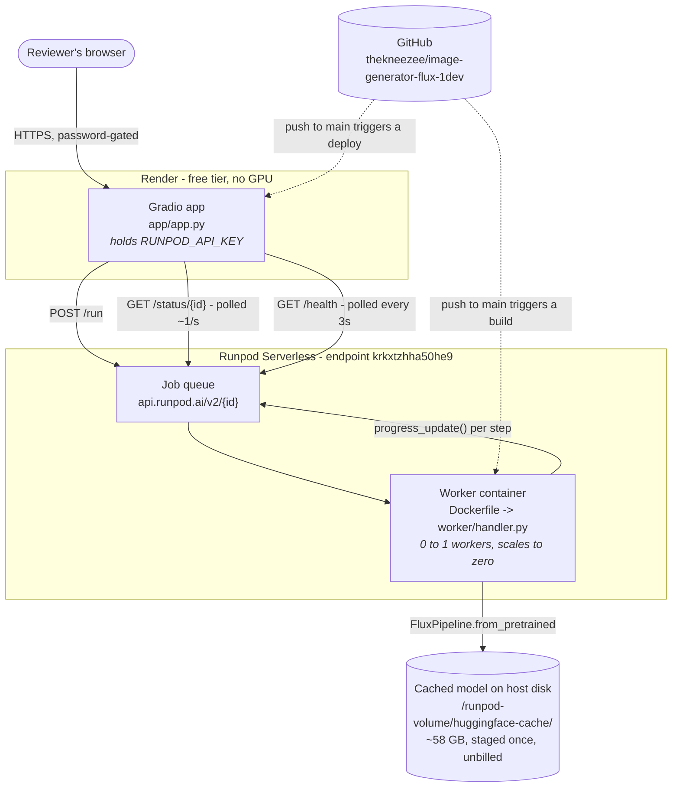

# Architecture

> New to this? Read [EXPLAINED.md](../EXPLAINED.md) first. It covers the
> same ground in plain language, without assuming any background.

## The shape of it

Three tiers, each scaling to zero:

| Tier | Runs on | Costs when idle |
|---|---|---|
| Chat UI | Render free instance | nothing (sleeps after 15 min) |
| Job queue | Runpod managed | nothing |
| FLUX.1-dev inference | Runpod GPU worker | nothing (0 active workers) |

That symmetry is the point. A reviewer's session costs a few cents; an
untouched deployment costs zero.

## Request lifecycle

1. The browser posts a prompt to the Gradio server. **The browser never sees a
   Runpod credential.**
2. The server validates loosely, then `POST /run` with the payload under
   `input`. Runpod returns a job id immediately.
3. The server polls `GET /status/{id}` about once a second.
4. If no worker is warm, Runpod starts one. The container boots, and
   `worker/handler.py` loads FLUX.1-dev into VRAM **at module level**, so the
   34 GB load happens once per worker rather than once per request.
5. The handler validates the input properly (`worker/schema.py`) and runs the
   diffusion loop. A `callback_on_step_end` hook fires
   `runpod.serverless.progress_update()` on each denoising step, throttled to
   ~0.4s.
6. Those updates appear in the `output` field of `/status` while the job is
   still running. The Gradio generator `yield`s on each one, and Gradio
   repaints the chat, so the user sees `Queued -> Cold start -> Encoding ->
   Denoising 14/28 -> Decoding -> image`.
7. On completion the handler returns a base64 PNG plus metadata: seed, GPU
   name, timings, and which weight tier was used.
8. The server decodes it, writes a temp file, appends it to the chat, and adds
   the request's cost to a session meter.

## Decisions, and what they cost

### Weights are not baked into the image

The brief says *"build a Docker image that includes your serverless handler
and the model."* Taken literally that means a ~46 GB image. Two things make
that impractical here:

- Runpod's GitHub builder enforces a **30-minute `docker build` timeout** and
  an **80 GB image cap**. Downloading 34 GB of weights inside the build would
  blow the timeout.
- It also cannot be done through the GitHub integration at all, because
  FLUX.1-dev is gated and the builder has no documented way to pass a
  Hugging Face token as a build secret. The only alternative is hard-coding
  the token in a public Dockerfile.

Runpod's own documentation ranks the options and puts **cached models first**
for gated Hugging Face models. So the endpoint's `Model` field is set to
`black-forest-labs/FLUX.1-dev` with an HF token stored as a Runpod secret.
Runpod pre-stages the repo onto the host machine, and **does not bill for the
download**.

Measured result: **27.7 minutes of staging, unbilled**, then a **7.5 second**
load from the host's local disk into VRAM. The container image stays at
~12 GB.

`worker/pipeline.py` still implements a runtime-download fallback, so the
worker functions if caching is unavailable, and every response reports
`weights_source` so you can see which path actually ran.

### `/run` + polling, not `/runsync`

`/runsync` blocks with a **90 second default ceiling**. A measured cold start
is ~14.5s of delay plus 7.5s of model load, and a 50-step generation is 40s -
so a cold 50-step request would exceed it and fail while the GPU was working
perfectly.

Polling also has the property that actually matters here: **progress updates
are only visible through `/status`.** Without it there is no per-step
narration, and the UI degrades to a spinner.

### Queue endpoint, not load balancing

Runpod's load-balancing endpoints offer lower latency and a 30 MB payload
limit. They also **drop requests when overloaded, have no retries, and cap
processing at 5.5 minutes**. Image generation is bursty and slow per request,
and a cold start can approach that cap. A queue with retries is the right
shape; a dropped generation is a bad experience for a user who waited.

### The API key never reaches the browser

Runpod has **no browser-safe publishable key and no per-origin allowlist**.
Every call needs a full `Authorization: Bearer` key, and a key restricted to a
single endpoint still permits unlimited GPU spend on it. Runpod's own SDXL
tutorial puts the key in client JavaScript and warns against it in the next
paragraph.

So the UI is a Python server. The key lives in Render's encrypted environment
and in a Runpod secret - never in the repository, never in a response body.

### A 48 GB GPU, and not a Blackwell one

FLUX.1-dev in bfloat16 is ~34 GB of weights: 23.8 GB transformer, 9.5 GB T5
text encoder, plus CLIP and the VAE. Add activations and a 24 GB card requires
CPU offloading, which is several times slower. The endpoint requests three
48 GB+ tiers in priority order so a busy tier falls back rather than throttles.

`PRO 6000 MIG 48GB` is deliberately **excluded**. It has 48 GB and appears in
the same tier, but it is an RTX PRO 6000 Blackwell slice, and the pinned
torch 2.4.0 has no kernels for that architecture. A worker placed there would
start cleanly and then fail on every generation.

## Things that bit, and what they taught

**A dependency that installs is not a dependency that works.** An open
`diffusers>=0.31` resolved to 0.39, which registers a custom torch operator
annotated `torch.Tensor | None`. torch 2.4.0's schema inference cannot parse
that syntax, so `from diffusers import FluxPipeline` raised at import time.
Nothing in pip's metadata declares the constraint. The Dockerfile now ends its
dependency stage with a real `import FluxPipeline`, so this class of failure
turns the **build** red instead of producing a worker that crash-loops - which
Runpod retries for up to seven days.

**A worker must never die on import.** `load_pipeline()` raises when no CUDA
device is present, which is correct. Calling it unguarded at module level
meant any load failure killed the process, which is indistinguishable from a
broken image. The load is now attempted at import, failures are recorded, and
retried on first request; if it still fails the caller gets a structured
`ModelNotLoaded` error naming the cause.

**Thresholds need margin.** The full-GPU cutoff was 44.0 GB. A nominally 48 GB
L40S reports 44.4 GB usable - a 0.4 GB margin. Lowered to 40.0.

**Progress is not where the docs imply.** Runpod exposes no `progress` key.
Verified against the live API: `progress_update()` payloads arrive in the
`output` field while a job runs, and `output` only becomes the return value
once the job is terminal. The client distinguishes them by the `phase` marker
the handler sets.

**One status can mean minutes or milliseconds.** `IN_QUEUE` covers a warm
dequeue (~1s), a cold start (~30s), and post-deployment host staging (tens of
minutes). The UI narrates all three differently rather than showing an
unexplained timer.

## Known limitations

- **Every push to `main` rebuilds the worker image**, including doc-only
  commits, and a rebuild can re-place workers onto a host that has not staged
  the model. Commits should be batched before a demo.
- **Render's free tier sleeps** after 15 minutes idle, adding ~50s to the
  first request on top of any Runpod cold start.
- **Runpod scales endpoints down** after inactivity: max workers drops to 2
  after 3 idle days and to 0 after 7. A demo link left untouched for a week
  will appear dead until max workers is raised again.
- **Batches are capped at 2 images.** `/run` allows a 10 MB payload and base64
  inflates by a third; a 1024x1024 PNG is ~1.25 MB, so larger batches would
  need S3 upload and a URL response instead.
- **Negative prompts roughly double cost.** FLUX.1-dev is guidance-distilled,
  so a negative prompt only takes effect with true CFG, which runs the
  transformer twice per step. The UI says so at the point of use.
